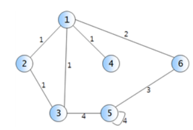

<h1><strong >그래프의 인접리스트, 인접행렬 구현하기</strong></h1>

## 문제 설명

1. ### 구현조건
- 위 그림처럼 무방향 가중 그래프가 주어지며, 정점이름과 간선, 간선의 가중치로 이루어진다. 위 그래프를 구현한다.
- 구현 후 문자 a, m, q를 입력받는다.
    - a 입력 후 (node number) : (node number)를 가지는 node와 인접한 node와 그 노드까지의 간선 가중치를 모두 인쇄. 단, node number의 오름차순으로 인쇄하되, space 외의 구분자 없이 노드번호 가중치 노드번호 가중치 ... 형식으로 인쇄한다. 그래프에 정점 a가 존재하지 않으면 아무 것도 하지 않고 –1을 출력한다.1
    - m 입력 후 (a b w) : 간선 (a, b)의 가중치를 w로 변경한다. 그러한 간선이 존재하지 않을 때는 가중치 w인 새로운 간선 (a, b)를 생성한다. w = 0이면 간선 (a, b)를 삭제한다. 그래프에 정점 a 혹은 b가 존재하지 않으면 아무 것도 하지 않고 –1을 출력한다.
    - q : 프로그램 종료

2. ### 예시
|입력 예시 | 출력 예시 |
|---|---|
|a 2 ↦ 노드번호 | □1 1 3 1|
|m 4 2 3 ↦ 간선 (4, 2)에 가중치 3 | |
|a 2 | □1 1 3 1 4 3	|
| q| |

## 문제 1
`인접리스트로 그래프 구현하기`

## 문제 2
`인접행렬로 그래프 구현하기`