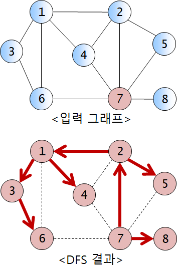
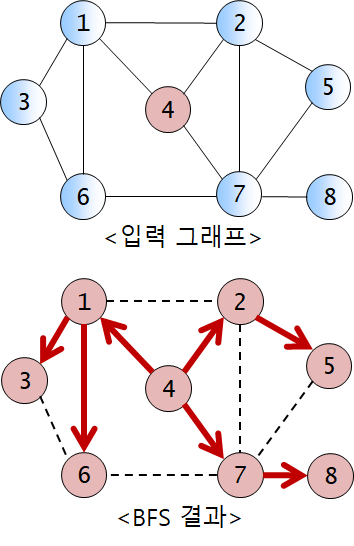

<h1><strong >그래프순회 - 깊이우선탐색 & 너비우선탐색 </strong></h1>

## 문제 1 (깊이우선탐색)
입력으로 주어지는 그래프의 DFS 순회 결과를 출력하는 프로그램을 작성하시오.

1. ### 입력 그래프 성질
- n (1 ≤ n ≤ 100) 개의 정점과 m (1 ≤ m ≤ 1,000) 개의 간선으로 구성
- 정점은 1 ~ n 사이의 정수로 번호가 매겨져 있고, 정점의 번호는 모두 다름
- 모든 간선은 무방향 간선이고, 한 정점에서 임의의 다른 정점으로 가는 경로는 반드시 존재

2. ### 구현 조건
- 그래프는 `인접리스트` 구조를 사용하여 표현해야 한다.
- 정점 u의 인접 정점(or 부착 간선)들을 번호가 작은 정점부터 조사한다.

3. ### 입력
- 첫 줄에 정점의 개수 `n`, 간선의 개수 `m`, 순회 시작 정점 번호 `s`가 주어진다.
- 이후 m개의 줄에 한 줄에 하나씩 간선의 정보(간선의 양 끝 정점 번호)가 주어진다.간선은 임의의 순서로 입력되고, 중복 입력되는 간선은 없다.(무방향 간선이므로 간선 (u, v)와 (v, u)는 동일한 간선으로 취급)

4. ### 출력
- 출발정점 `s`에서 출발하는 `DFS`의 방문 순서대로 정점 번호를 출력한다.

5. ### 예시

|입력 예시| 출력 예시|
|---|---|
|8 12 7 ↦ n = 8, m = 12, s = 7 | 7|
|1 2| 2|
|2 4| 1|
|4 7| 3|
|3 6 | 6|
|6 1 | 4|
|6 1 | 5|
|7 6 | 8|
|7 8 | |
|1 3 | |
|2 7 | |
|1 4 | |
|2 5 | |
|7 5 | |

---

## 문제 2 (너비우선탐색)
입력으로 주어지는 그래프의 BFS 순회 결과를 출력하는 프로그램을 작성하시오.

1. ### 입력 그래프 성질
- 문제 1과 동일

2. ### 구현 조건
- 그래프는 `인접행렬` 구조를 사용하여 표현해야 한다.
- 문제 1과 동일하게 정점의 인접 정점(or 부착 간선)들을 번호가 작은 정점부터 조사한다.

3. ### 입력
- 입력 : 문제 1과 동일

4. ### 출력
- 출발정점 `s`에서 출발하는 `BFS`의 방문 순서대로 정점 번호를 출력한다.

5. ### 예시

|입력 예시| 출력 예시|
|---|---|
|8 12 4|4
|1 2|1|
|2 4|2|
|4 7|7|
|3 6|3|
|6 1|6|
|7 6|5|
|7 8|8|
|1 3||
|2 7||
|1 4||
|2 5||
|7 5||
