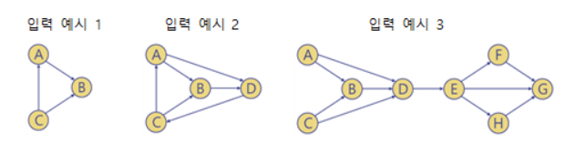

<h1><strong >방향그래프 </strong></h1>

## 문제 (위상순서 찾기)
주어진 방향그래프 G에 대해 다음과 같이 수행하는 프로그램을 작성하라.   
1) G가 방향 비싸이클 그래프(directed acyclic graph: DAG)면 위상순서(topological order)를 구해 인쇄.   
2) G에 방향 싸이클(directed cycle)이 존재하면 위상순서를 구할 수 없으므로 0을 인쇄

### 1. 구현 조건
- 방향싸이클의 존재여부 검사와 위상순서 구하기를 별도 작업으로 수행하면 전체 실행시간이 늘어나므로, 위상순서를 구하는 과정에서 방향싸이클의 존재 여부를 확인할 수 있도록 작성해야 한다.

- 원래 어떤 그래프에 대한 위상순서는 여러 개 있을 수 있다. 하지만 채점편의 상, 이 문제는 그 가운데 단 한 개의 위상순서만 출력 가능하도록 다음 사항을 준수해야 한다. 아래의 “알고리즘 설계 팁”도 이에 맞게 작성되어 있다.
    - 그래프의 부착리스트 구축 시, 새로 입력되는 간선에 대한 노드를 리스트의 맨 앞에 삽입해야 한다(이전 실습에서는 정점번호의 오름차순으로 부착리스트 유지).
    - 위상 정렬 알고리즘에서 최초로 진입간선의 개수가 0인 정점을 찾을 때, 정점번호 순서대로 조사해야 한다.

### 2. 입력
main 함수는 아래 형식으로 방향그래프를 표준입력 받는다.
- `첫 번째 라인` : 정점 수(n)
- `두 번째 라인` : 정점들의 이름(단순 문자 - 예: 영문자, 숫자 등)
- `세 번째 라인` : 방향간선 수(m)

### 3. 출력
main 함수는 다음을 표준출력한다.
- `위상순서` (정점들의 이름을 인쇄)

### 4. 예시

|입력 예시 1| 출력 예시1|
|---|---|
|3 ↦ n = 정점 수 |C A B ↦ 위상순서 |
|A B C ↦ 정점들 | |
|3 ↦ m = 간선 수 | |
|A B ↦ 간선 정보 | |
|C A ↦ 간선 정보 | |
|C B ↦ 간선 정보 | |

|입력 예시2 | 출력 예시2|
|---|---|
|4 ↦ n = 정점 수 |0 ↦ 방향싸이클 존재 하므로 위상순서 없음 |
|A B C D ↦ 정점들 | |
|6 ↦ m = 간선 수 | |
|A B ↦ 간선 정보 | |
|C A ↦ 간선 정보 | |
|C B ↦ 간선 정보 | |
|A D ↦ 간선 정보 | |
|B D ↦ 간선 정보 | |
|D C ↦ 간선 정보 | |

|입력 예시3 | 출력 예시3|
|---|---|
|8 ↦ n = 정점 수 |A C B D E H F G ↦ 위상순서 |
|A B C D E F G H ↦ 정점들 | |
|11 ↦ m = 간선 수 | |
| A B ↦ 간선 정보| |
| C B ↦ 간선 정보| |
| A D ↦ 간선 정보| |
|B D ↦ 간선 정보 | |
| D E ↦ 간선 정보| |
|E F ↦ 간선 정보 | |
| E H ↦ 간선 정보| |
|E G ↦ 간선 정보 | |
| F G ↦ 간선 정보| |
| H G ↦ 간선 정보| |