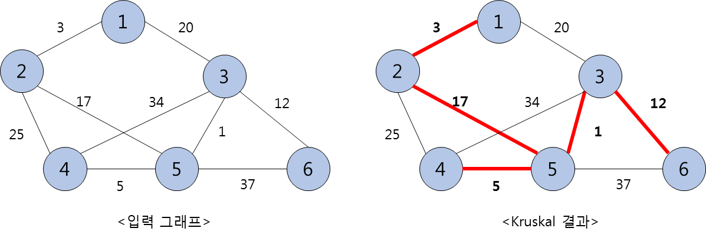

<h1><strong >최소신장트리 - Prim-Jarnik & Kruskal 알고리즘 </strong></h1>

## 문제 1 (Prim-Jarnik 알고리즘)
입력으로 주어지는 그래프를 Prim-Jarnik 알고리즘을 이용하여 최소신장트리(Minimum Spanning Tree, MST)를 생성하는 프로그램을 작성하고, 최소신장트리의 생성 과정과 총무게를 결과로 출력하시오. 

### 1. 입력 그래프 성질
- n (1 ≤ n ≤ 100) 개의 정점과 m (1 ≤ m ≤ 1,000) 개의 간선으로 구성된다.
- 정점은 1 ~ n 사이의 정수로 번호가 매겨져 있고, 정점의 번호는 모두 다르다.
- 모든 간선은 무방향간선이고, 한 정점에서 임의의 다른 정점으로 가는 경로는 반드시 존재한다.
- 간선의 무게는 중복이 없는 양의 정수다.

### 2. 구현 조건
- 알고리즘 수행의 출발정점은 번호가 가장 빠른 정점인 1부터 시작한다.
- Prim-Jarnik 알고리즘의 첫 출발정점은 그래프 내 아무 정점이라도 무방하지만, 이번 실습에서는 번호가 가장 빠른 정점인 1에서 출발해야 OJ 시스템의 정답과 일치시킬 수 있다.

### 3. 입력
- 첫 줄에 정점의 개수 `n`, 간선의 개수 `m`이 주어진다.
- 이후 `m`개의 줄에 한 줄에 하나씩 간선의 정보(간선의 양끝 정점 번호와 무게)가 주어진다. 간선은 임의의 순서로 입력되고, 중복 입력되는 간선은 없다.(무방향간선이므로 간선 `(u, v)`와 `(v, u)`는 동일한 간선으로 취급)
- 무게로는 양의 정수가 입력되고, 중복되는 무게는 없다.

### 4. 출력
- 모든 정점의 번호를 출력한 후, 마지막 줄에 MST 간선 무게의 합 즉, 총무게를 출력한다.

### 5. 예시

|입력 예시| 출력 예시|
|---|---|
|5 7 ↦ n = 5, m = 7 |□1 2 4 5 3 ↦ MST 생성시 추가되는 정점 |
|1 2 1 ↦ 정점, 정점, 무게 | 11 ↦ MST 총무게|
|1 4 2 | |
|1 5 4 | |
|2 5 7 | |
|4 5 3 | |
|3 5 5 | |
|2 3 6 | |

---

## 문제 2 (Kruskal 알고리즘)
입력으로 주어지는 그래프를 Kruskal 알고리즘을 이용하여 최소신장트리(Minimum Spanning Tree, MST)를 생성하는 프로그램을 작성하고, 최소신장트리의 생성 과정과 총무게를 결과로 출력하시오. 

### 1. 입력 그래프 성질
- 문제 1과 동일

### 2. 구현 조건
- Kruskal 알고리즘 구현 시, 우선순위 큐와 분리집합의 구현이 필요할 수 있다.

### 3. 입력
- 입력 : 문제 1과 동일

### 4. 출력
- 최소신장트리(MST) 생성 과정에서 추가되는 간선의 무게를 순서대로 출력한다.
- 모든 간선의 무게를 출력한 후, 마지막 줄에 MST 간선 비용의 합 즉, 총무게를 출력한다.

### 5. 예시

|입력 예시| 출력 예시|
|---|---|
|6 9 ↦ n = 6, m = 9 |□1 3 5 12 17 ↦ MST 간선 무게 |
|1 2 3 ↦ 정점, 정점, 무게 |38 ↦ MST 총무게 |
|1 3 20 | |
|2 4 25 | |
|2 5 17 | |
|3 4 34 | |
|3 5 1 | |
|3 6 12 | |
|4 5 5 | |
|5 6 37 | |

|입력 예시| 출력 예시|
|---|---|
|5 7 ↦ n = 5, m = 7 |□9 19 31 51 ↦ MST 간선 무게 |
|1 2 75  ↦ 정점, 정점, 무게 |110 ↦ MST 총무게 |
|1 4 95 | |
|1 3 51 | |
|2 4 9 | |
|4 3 19 | |
|4 5 42 | |
|3 5 31 | |
