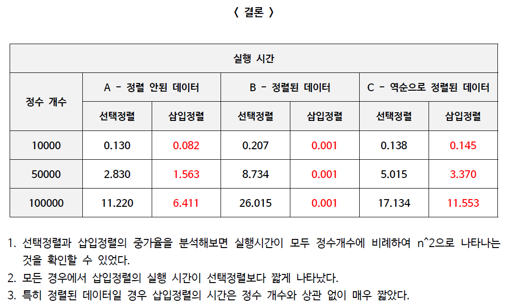

<h1><strong >우선순위 큐 구현하기</strong></h1>

## 문제 1 (선택정렬) 
n개의 양의 정수(중복 가능)를 입력받아, 아래에서 설명하는 선택 정렬을 이용하여 정렬하는 프로그램을 작성하시오.

1. ### 구현 조건
- 크기가 n인 배열을 동적 할당하여, 입력된 양의 정수 저장(입력 정수는 중복 가능)
- 제자리(in place) 정렬 사용.즉, 입력 값 저장을 위한 배열 이외에 O(1)의 추가 공간만 사용
- 배열의 뒷 부분을 정렬 상태로 유지하고, 매 반복마다 최대 한 번의 교환 연산만 사용(매 반복마다 가장 큰 값을 찾아, 오른쪽부터 채우는 방식으로 정렬)
- 참고: 아래 그림에 예시된 버전은 매 반복마다 가장 작은 값을 찾아 왼쪽부터 채워 나가는, 따라서 교재의 알고리즘과는 정반대 방향으로 작동하는 버전이다.

2. ### 예시

|입력 예시| 출력 예시|
|---|---|
|8 ↦ n|□3 8 20 29 31 48 65 73 ↦ 정렬 결과|
|8 31 48 73 3 65 20 29| |

---

## 문제 2 (삽입정렬)

1. ### 구현 조건
- 크기가 n인 배열을 동적 할당하여, 입력된 양의 정수 저장(입력 정수는 중복 가능)
- 제자리(in-place) 정렬 사용.즉, 입력 값 저장을 위한 배열 이외에 O(1)의 추가 공간만 사용
- 배열의 앞부분을 정렬 상태로 유지
- 가능하면 교재의 의사코드를 보지 말고 구현해볼 것을 권장

2. ### 예시

|입력 예시| 출력 예시|
|---|---|
|7 ↦ n|□3 8 11 20 31 48 73 ↦ 정렬 결과|
|3 73 48 31 8 11 20| |

---

## 문제 3 (실행시간 비교)
여러가지 다양한 입력에 대해 선택 정렬과 삽입 정렬의 실행시간을 측정 비교하라.

1. ### 구현 조건
- 정렬할 원소의 개수 n을 표준입력 받고, 크기가 n인 정수 배열 A와 B를 동적할당 받는다.
- 난수발생 함수(srand, rand 등)를 사용하여 n개의 정수 난수로 배열 A와 B를 동일하게 초기화한다.
- 배열 A에 대해서는 선택 정렬을, 배열 B에 대해서는 삽입 정렬을 수행하고, 시간측정 함수(clock 등)를 이용하여 각 정렬에 소요된 시간을 표준출력한다.

2. ### 예시

|입력 예시| 출력 예시|
|---|---|
|100000 ↦ n|0.051289721ms ↦ 선택 정렬 수행시간|
| |0.054142322ms ↦ 삽입 정렬 수행시간|

3. ### 비교 결과

